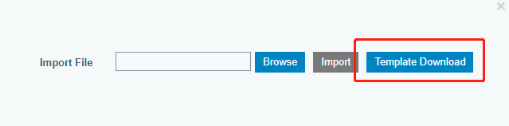
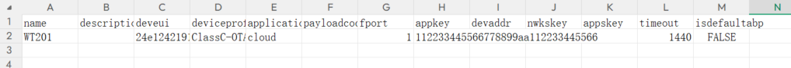
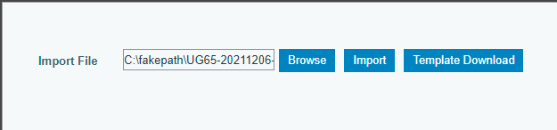
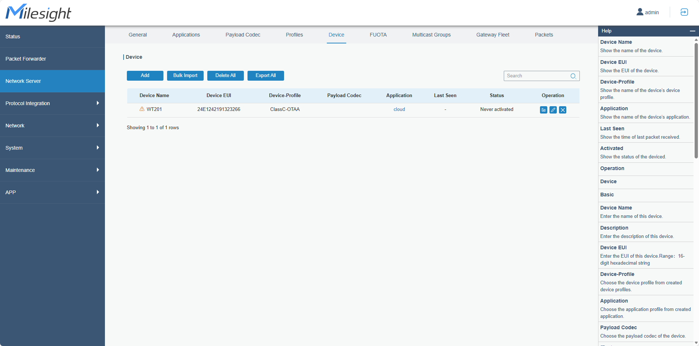

How to Bulk Import Devices in Milesight Embedded Network Server

{alt="C:\\Users\\Iris\\Desktop\\完整word\\word模板竖版_英文.jpgword模板竖版_英文"
width="8.274305555555555in" height="11.70625in"}

# Description

Milesight LoRaWAN Gateway supports to download template and import
multiple devices conveniently.

This article describes how to bulk import devices in Milesight Embedded
Network Server. If you need to add single device, please refer to [How
to Connect LoRaWAN Nodes to Milesight
Gateway](http://support.milesight-iot.com/en/support/solutions/articles/73000514280).

# Requirement

- Milesight LoRaWAN Gateway

- LoRaWAN end-devices

# Configuration

1.Make sure there has been at least 1 application and profile
on **Network Server \> Applications** and **Network Server \>
Profiles**. Please refer to this article:  [How to Connect LoRaWAN Nodes
to Milesight
Gateway](http://support.milesight-iot.com/en/support/solutions/articles/73000514280).
In this article, we use **cloud** in the application,
and **ClassA-OTAA** in the profile.

2.Go to **Network Server \> Device**, click **Bulk Import** and download
the
template.{width="5.766666666666667in"
height="1.7986111111111112in"}{width="5.764583333333333in"
height="1.425in"}

3.Fill in the information of device in template.csv. Attributes needed:\
If the **Join Type** is select as **OTAA**,\
input: name, description, deveui, deviceprofile,application,
payloadcodec,fport, appkey,timeout, isdefaultabp(leave FALSE).\
if **ABP**:\
input: name, description, deveui, deviceprofile,application,
payloadcodec,fport, timeout, isdefaultabp(If \"isdefaultabp\" is TRUE,
you do not need to fill in devaddr, appskey, and nwkskey. If
\"isdefaultabp\" is FALSE, you need to fill in devaddr, appskey, and
nwkskey.)

{width="6.5055555555555555in"
height="0.3368055555555556in"}

4.Take WT201 as an example.

{width="6.053472222222222in"
height="0.4076388888888889in"}

5.Click **Browse** to locate the .csv file and import
it.{width="5.761805555555555in"
height="1.3458333333333334in"}

6.After bulk import is done successfully, you will see all the sensor
that you fill in the .CSV
file.{width="6.301388888888889in"
height="3.1243055555555554in"}{width="6.307638888888889in"
height="3.1277777777777778in"}

 

**\--END\--**
